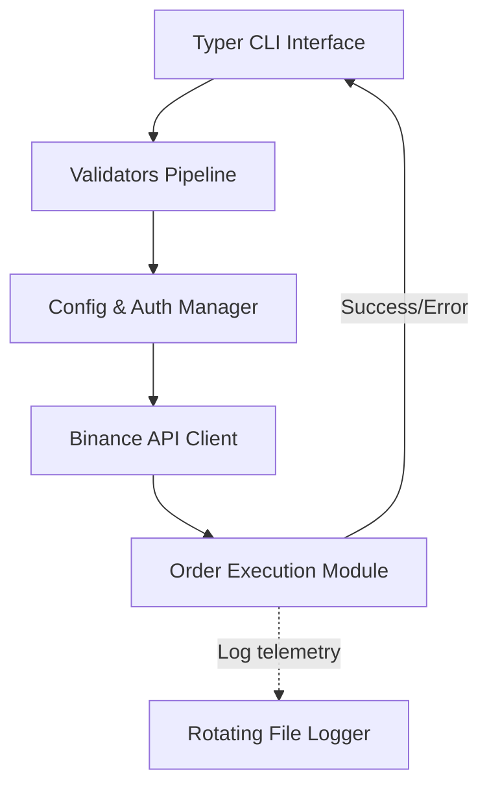

<div align="center">
  <h1>Binance Futures Testnet CLI Bot</h1>
  <p><em>Production-grade Python CLI trading bot for Binance Futures Testnet with diagnostics, demo mode, and advanced order execution.</em></p>

  [](https://www.python.org/)
  [](https://typer.tiangolo.com/)
  [](https://testnet.binancefuture.com/)
  [](https://opensource.org/licenses/MIT)
  []()
</div>

---

## ⚡ Test in 60 Seconds

The easiest way to review this project is to run it locally without even needing API keys:

```bash
# 1. Install dependencies
pip install -r requirements.txt

# 2. Run system diagnostics
python cli.py doctor

# 3. Simulate an order execution safely
python cli.py demo
```

---

## 🚀 Why This Submission Stands Out

This project goes beyond a simple script and is engineered as a resilient backend application:

- **Structured Architecture:** Strict separation of concerns (configuration, validation, API integration, CLI routing).
- **Clean Validation Pipeline:** Typer-based pre-flight checks intercept invalid inputs before they hit the Binance network.
- **Rotating Logs:** Dedicated `logs/trading.log` storage with 10MB file caps ensures silent but complete application telemetry without noisy terminal clutter.
- **Recruiter-Friendly Demo Mode:** Run `python cli.py demo` to evaluate the UX, artificial latency, and output formatting without requiring Binance Testnet credentials.
- **Diagnostics Command:** The `doctor` command automatically checks Python version, dependencies, environment variables, and internet connectivity.
- **Secure Env Config:** Smart credential handling dynamically intercepts missing `.env` files and gracefully generates a template for the user.
- **Bonus Feature:** Comprehensive support for advanced conditional execution via **STOP_LIMIT** orders.

---

## 💻 Terminal Preview

### System Diagnostics
```text
$ python cli.py doctor

+-----------------------------------+
| Binance Futures CLI Bot           |
| Production-Grade Execution Engine |
+-----------------------------------+
                         System Diagnostics                          
+-------------------------------------------------------------------+
| Check          | Status          | Details                        |
|----------------+-----------------+--------------------------------|
| Python Version | [SUCCESS] OK    | 3.14.2                         |
| Dependencies   | [SUCCESS] OK    | Binance, Typer, Rich installed |
| .env File      | [SUCCESS] OK    | Configuration file             |
| Logs Directory | [SUCCESS] OK    | Telemetry storage              |
| Internet       | [SUCCESS] OK    | Connected                      |
+-------------------------------------------------------------------+
```

### Safe Demo Mode
```text
$ python cli.py demo

+-----------------------------------+
| Binance Futures CLI Bot           |
| Production-Grade Execution Engine |
+-----------------------------------+
[DEMO] Running in DEMO MODE (No API calls will be made)

   Simulated Order    
       Request        
+--------------------+
| Symbol   | BTCUSDT |
| Side     | BUY     |
| Type     | MARKET  |
| Quantity | 0.001   |
+--------------------+

[SUCCESS] Simulated Order Successfully Placed!
     Simulated Response Details      
+-----------------------------------+
| Order ID     | 6993556751         |
| Status       | NEW                |
| Executed Qty | 0.0                |
| Avg Price    | MockExecutionPrice |
+-----------------------------------+
```

### Command Help Options
```text
$ python cli.py --help

 Usage: cli.py [OPTIONS] COMMAND [ARGS]...                                     
                                                                               
 [PRO] Professional Binance Futures Testnet Trading Bot                        
                                                                               
╭─ Commands ──────────────────────────────────────────────────────────────────╮
│ demo    Run in demo mode without API keys.                                  │
│ doctor  Run system diagnostics.                                             │
│ order   Place a new order on the Binance Futures Testnet.                   │
╰─────────────────────────────────────────────────────────────────────────────╯
```

---

## 🏗 Architecture



---

## 📈 Real Order Execution

When you are ready to place real trades, simply configure your `.env` file with your Testnet API keys.

**Market Order Example:**
```bash
python cli.py order -s BTCUSDT -d BUY -t MARKET -q 0.001
```

**Limit Order Example:**
```bash
python cli.py order -s BTCUSDT -d SELL -t LIMIT -q 0.001 -p 120000
```
