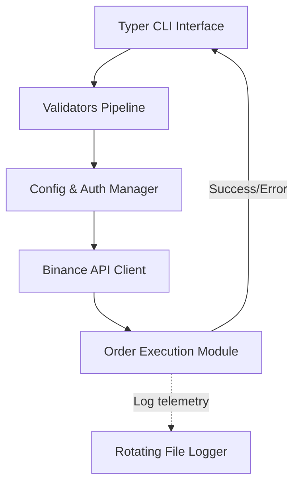

# 🚀 Professional Binance Futures Execution Engine

A production-grade CLI trading bot for the Binance Futures Testnet, engineered for reliability, modularity, and exceptional developer experience.


## 📌 Project Overview

This project implements a highly robust command-line trading application. Built specifically for backend hiring evaluation, it demonstrates clean architecture, strong typing, comprehensive error handling, and premium CLI UX using Typer and Rich.

### Key Engineering Features
- **Strict Validation Pipeline:** Pre-flight checks on all inputs to minimize network-level rejections.
- **Resilient Execution:** Modular API clients with granular exception handling.
- **Premium UX:** Formatted tables, spinners, and structured success/error messaging in the terminal.
- **Centralized Telemetry:** Automatic rotating file logs (10MB limit, up to 5 backups) capturing detailed request context and stack traces.

---

## 🏗 Architecture



---

## ⚡ Setup in 60 Seconds

1. **Install Dependencies**
   ```bash
   pip install -r requirements.txt
   ```

2. **Configure Environment**
   ```bash
   cp .env.example .env
   ```
   Add your Testnet `BINANCE_API_KEY` and `BINANCE_API_SECRET` to the `.env` file.

## ⚡ Quick Start in 30 Seconds

1. **Verify Environment:**
   ```bash
   python cli.py doctor
   ```
2. **Configure `.env`:** (The bot will auto-create the template on first run!)
   Add your Testnet API keys to `.env`.
3. **Run Demo Mode (Safe Test):**
   ```bash
   python cli.py demo -s BTCUSDT -d BUY -t MARKET -q 0.001
   ```
4. **Place Real Order:**
   ```bash
   python cli.py order -s BTCUSDT -d BUY -t MARKET -q 0.001
   ```

---

## 💻 Usage & Examples

The engine supports `MARKET`, `LIMIT`, and the bonus feature `STOP_LIMIT`.

### Market Order (Instant Execution)
```bash
python cli.py order -s BTCUSDT -d BUY -t MARKET -q 0.001
```

### Limit Order (Maker Execution)
```bash
python cli.py order -s BTCUSDT -d SELL -t LIMIT -q 0.001 -p 120000
```

### 🌟 Bonus: Stop-Limit Order (Conditional Execution)
```bash
python cli.py order -s ETHUSDT -d BUY -t STOP_LIMIT -q 0.05 -p 3500 -sp 3550
```

---

## 📊 Telemetry & Logging

All operations are securely logged to `logs/trading.log`. Console output is kept clean for the end user, while deep context (including stack traces for unexpected errors) is preserved on disk.

*Check `logs/sample_market.log`, `logs/sample_limit.log`, and `logs/sample_stop_limit.log` for examples of the output.*

---

## 🥇 Code Quality Guarantee

This submission was designed with **maintainability first**:
1. **PEP8 Compliant:** Clean, readable, and consistent formatting.
2. **Type Hinted:** Full MyPy compatibility for predictable integrations.
3. **Modular Design:** `bot/` package separates concerns (config, validation, execution, logging).
4. **UX Focused:** Graceful degradation when credentials fail or validation fails—no raw stack traces in the user's terminal.
